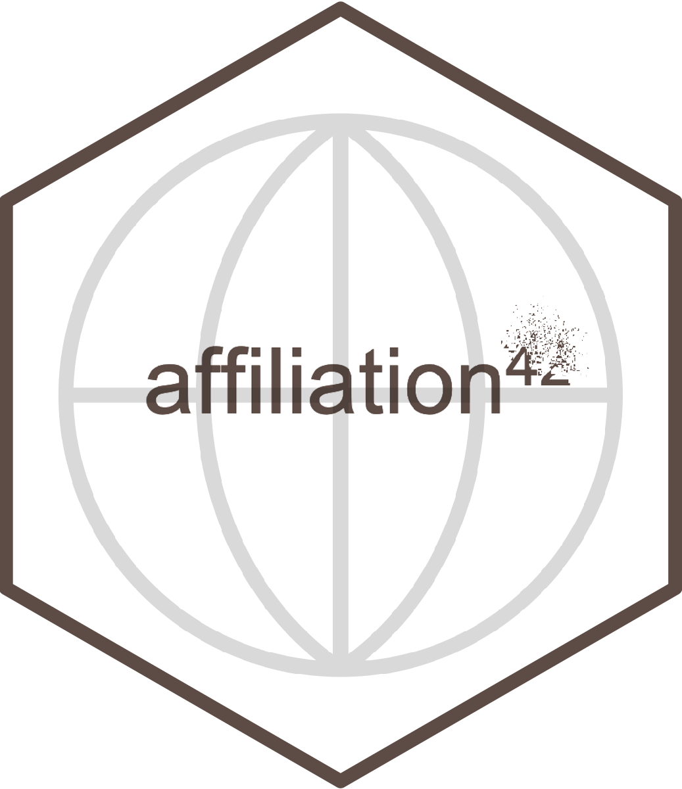
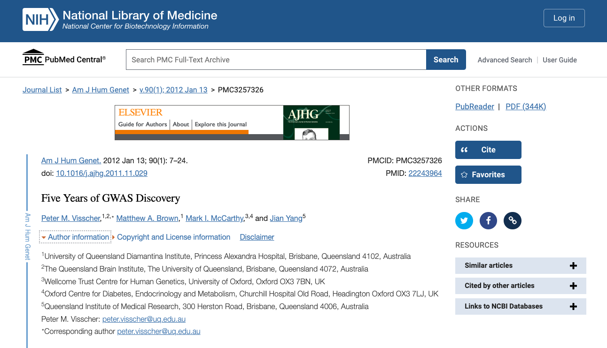

# affiliarion <a href='https://github.com/hugofitipaldi/affiliation'></a>

<!-- badges: start - -->

[](https://github.com/hugofitipaldi/affiliation)
[](https://lifecycle.r-lib.org/articles/stages.html#experimental)
[](https://github.com/hugofitipaldi/affiliation/commits/main)

<!-- badges: end -->

## Installation

Development version of the package can be installed from Github with:

``` r
install.packages("remotes")
remotes::install_github("hugofitipaldi/affiliation")
```

## Usage

### Country of affiliation

``` r
affiliation::get_affiliations(PMID = "30237159")
#>   author_lastname author_firstname                       country_of_affiliation
#> 1       Fitipaldi             Hugo                              Sweden_NA_NA_NA
#> 2        McCarthy           Mark I          United Kingdom_United Kingdom_NA_NA
#> 3          Florez           Jose C United States_United States_United States_NA
#> 4          Franks           Paul W   Sweden_United Kingdom_United States_Sweden
#>                                                                                                                                                                                                                                                                                                                                                                                                                              affiliation_freetext
#> 1                                                                                                                                                                                                                                                                             Genetic and Molecular Epidemiology Unit, Department of Clinical Sciences Malmö, Lund University Diabetes Centre, Skåne University Hospital, Malmö, Sweden._NA_NA_NA
#> 2                                                                                                                                                                                                                                                                 Oxford Centre for Diabetes, Endocrinology and Metabolism, University of Oxford, Oxford, U.K._Wellcome Trust Centre for Human Genetics, University of Oxford, Oxford, U.K._NA_NA
#> 3                                                                                                                                                                                           Diabetes Unit and Center for Genomic Medicine, Massachusetts General Hospital, Boston, MA._Programs in Metabolism and Medical and Population Genetics, Broad Institute, Cambridge, MA._Department of Medicine, Harvard Medical School, Boston, MA._NA
#> 4 Genetic and Molecular Epidemiology Unit, Department of Clinical Sciences Malmö, Lund University Diabetes Centre, Skåne University Hospital, Malmö, Sweden paul.franks@med.lu.se._Oxford Centre for Diabetes, Endocrinology and Metabolism, University of Oxford, Oxford, U.K._Department of Nutrition, Harvard T.H. Chan School of Public Health, Boston, MA._Department of Public Health and Clinical Medicine, Umeå University, Umeå, Sweden.
```

### Function for non-indexed publications

For publications in PubMed with lack of affiliation information, such as
for publications prior to 2014 (when PubMed only included the first
author affiliation among the accessible metadata information), the
extraction of country of affiliation can be done by the
`auth_aff_dict()` function.

This function was built based on the structure in which
author-affiliation information is presented at PubMed Central (PMC):



The same dictionary-like structure is also extensively used in the PDF
formats of publications, thus, one can simply copy and paste this
information and use it as parameters for the the function:

``` r
authors_names <- "Peter M. Visscher,1,2 Matthew A. Brown,1 Mark I. McCarthy,3,4 Jian Yang,5"

affiliation_dict <- "1 University of Queensland Diamantina Institute, Princess Alexandra Hospital, Brisbane, Queensland 4102, Australia
2 The Queensland Brain Institute, The University of Queensland, Brisbane, Queensland 4072, Australia
3 Wellcome Trust Centre for Human Genetics, University of Oxford, Oxford OX3 7BN, UK
4 Oxford Centre for Diabetes, Endocrinology and Metabolism, Churchill Hospital Old Road, Headington Oxford OX3 7LJ, UK
5 Queensland Institute of Medical Research, 300 Herston Road, Brisbane, Queensland 4006, Australia"

affiliation::auth_aff_dict(authors_names, affiliation_dict)
#> # A tibble: 4 × 3
#> # Groups:   author_fullname [4]
#>   author_fullname   country_of_affiliation        affiliation_freetext          
#>   <chr>             <chr>                         <chr>                         
#> 1 Peter M. Visscher Australia_Australia           1 University of Queensland Di…
#> 2 Matthew A. Brown  Australia                     1 University of Queensland Di…
#> 3 Mark I. McCarthy  United Kingdom_United Kingdom Wellcome Trust Centre for Hum…
#> 4 Jian Yang         Australia                     Queensland Institute of Medic…
```

**If you use this package in you research, please cite:**

Hugo Fitipaldi, Paul W Franks, *Ethnic, gender and other
sociodemographic biases in genome-wide association studies for the most
burdensome non-communicable diseases: 2005–2022*, Human Molecular
Genetics, 2022;, ddac245, <https://doi.org/10.1093/hmg/ddac245>
